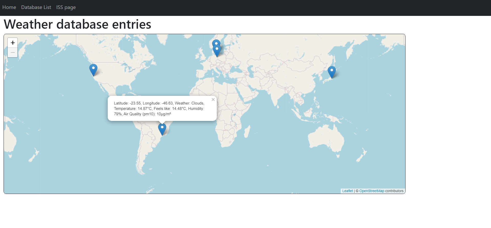

# Weather App

A simple web application built using Node.js, Leaflet.js, Express, MongoDB and Bootstrap. It allows users to identify their location, current weather (using the [OpenWeather API](https://openweathermap.org/)) and air quality information (using the [Open Air Quality API](https://openaq.org/#/)). Users can also see the location of all other users that have located themselves using the app, and can delete their location entry. The app is hosted on [Heroku](https://location-app-1.herokuapp.com/).

The app consists of the following pages:
1. A home page where users can find their location, weather information, air quality information and view it on a map.

2. A map of all previous locations identified.

3. A list of all previous locations identified.

4. A page that tracks the International Space Station (ISS) in real time.

## Running the app
To install and run the app locally:
1. Install dependencies by using `npm install`
2. Rename `.env_sample` to `.env` and fill in their MongoDB Atlas username, password and OpenWeather API key.
3. Start the server by using `node server.js`

## Viewing the web page
Go to `http://localhost:3000/` on a web browser
